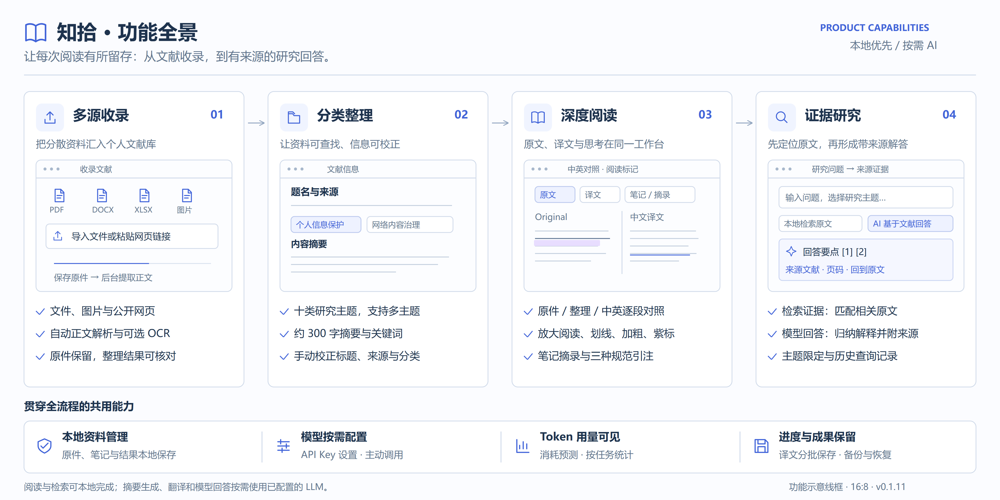

# 知拾 Zhishi

本地优先的文献阅读与知识工作台，当前版本 **0.1.11**。

## 功能



- PDF、Word、Excel、图片、文本及公开网页收录与正文解析。
- 十类研究主题、原件与整理阅读、笔记、摘录和文字标记。
- 法学引注手册、GB/T 7714—2015、APA 引注；标题及引注双击编辑。
- 本地同义概念与 BM25 证据检索，原文位置回跳。
- 用户主动授权的模型摘要、带来源回答、视觉解析和中英逐段翻译。
- 翻译分批显示并保存，重启续译跳过已保存片段；记录各任务 Token 用量。

## 架构


React / TypeScript → Electron IPC → 本机 FastAPI / Python 引擎 → 原件、版本化 JSON 与 SQLite。
可选云端模型兼容 OpenAI 风格接口；本地检索无需模型。详见 [架构说明](docs/architecture/README.md)。

## 开发与运行

Windows 优先，需 Node.js 22.12+、Python 3.12、uv。

```powershell
uv sync --frozen
npm ci
npm run dev
```

正常使用打包桌面程序不需要另装 Python。OCR 可选使用本机 Tesseract 与相应语言包。

```powershell
uv run pytest
npm test
npm run build
npm run make
```

## 模型配置

在应用“解析与偏好”中设置 API Key、服务地址和模型名称，即可使用摘要、证据问答与逐段翻译。模型功能按需开启，本地阅读与检索无需配置 API Key。

## 文档与许可

- [产品设计](docs/知拾-MVP-PRD.md)
- [初始技术方案](docs/知拾-MVP-技术方案.md)（历史设计，当前实现以代码和架构图为准）
- [第三方依赖与分发](docs/依赖与分发说明.md)
## 使用许可

原创代码、文档与图示采用[知拾非商业使用与来源署名许可证 1.0](LICENSE)，仅限非商业使用。商业用途须另行取得书面授权。

再分发或修改版本须保留作者、[原始项目](https://github.com/BJthulaw/zhishi)链接和许可声明，并注明修改内容；具体署名格式及第三方来源见 [NOTICE.md](NOTICE.md)。

第三方依赖继续适用各自许可。PyMuPDF 的 AGPL／商业授权要求独立处理；非商业条款不替代其许可，也不表示包含该依赖的组合发行已获得兼容授权。详见[依赖与分发说明](docs/依赖与分发说明.md)。
