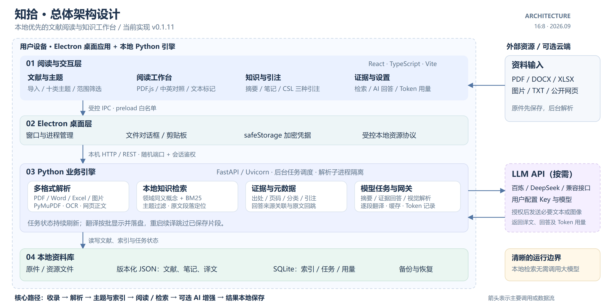

# 知拾 Zhishi

本地优先的文献阅读与知识工作台，当前版本 **0.1.11**。

## 功能

- PDF、Word、Excel、图片、文本及公开网页收录与正文解析。
- 十类研究主题、原件与整理阅读、笔记、摘录和文字标记。
- 法学引注手册、GB/T 7714—2015、APA 引注；标题及引注双击编辑。
- 本地同义概念与 BM25 证据检索，原文位置回跳。
- 用户主动授权的模型摘要、带来源回答、视觉解析和中英逐段翻译。
- 翻译分批显示并保存，重启续译跳过已保存片段；记录各任务 Token 用量。

## 架构



React / TypeScript → Electron IPC → 本机 FastAPI / Python 引擎 → 原件、版本化 JSON 与 SQLite。
可选云端模型兼容 OpenAI 风格接口；本地检索无需模型。详见 [架构说明](docs/architecture/README.md)。

## 开发与运行

Windows 优先，需 Node.js 22.12+、Python 3.12、uv。

```powershell
uv sync --frozen
npm ci
npm run dev
```

正常使用打包桌面程序不需要另装 Python。OCR 可选使用本机 Tesseract 与相应语言包。

```powershell
uv run pytest
npm test
npm run build
npm run make
```

## 隐私与配置

本仓库仅分发程序源码、人工构造的测试和设计文档。**不包含 API Key、个人知识库、上传文献、阅读笔记、真实资料截图、运行记录或构建安装包**。
API Key 在应用“解析与偏好”中配置，由 Electron safeStorage 加密保存；资料库位于系统用户配置目录，可在应用中更换路径。不要把资料库放入源码仓库。
模型任务会发送用户授权的必要文献内容；失败且未返回结果的请求再次尝试可能再次消耗 Token。

这是从本地开发项目导出的独立仓库，以全新 Git 历史开始，不附带旧项目和个人验收历史。依赖本机个人文献的测试及相应截图不分发。

## 文档与许可

- [产品设计](docs/知拾-MVP-PRD.md)
- [初始技术方案](docs/知拾-MVP-技术方案.md)（历史设计，当前实现以代码和架构图为准）
- [第三方依赖与分发](docs/依赖与分发说明.md)

当前项目声明为 UNLICENSED；第三方 CSL 样式、citeproc 等许可和署名随源文件保留。
